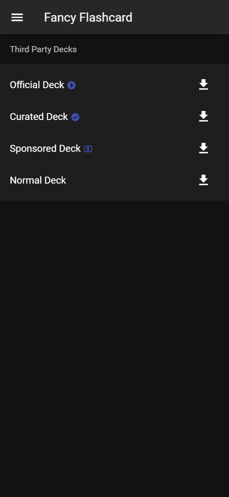
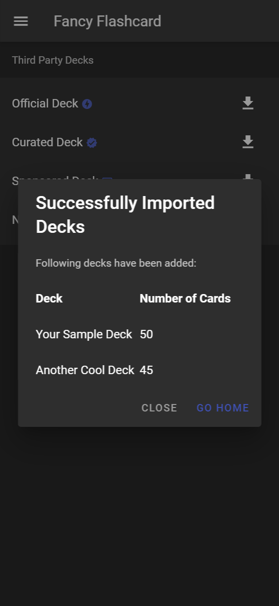

<!-- README inspired by https://github.com/othneildrew/Best-README-Template -->

  

  <h3 align="center">Fancy Flashcard</h3>

  

    Lightweight free and open-source PWA to help you learning on all your devices
     
    <a href="docs/"><strong>Explore the docs »</strong></a>
     
     
    <a href="https://fancy-flashcard.github.io/ffc/">Start Learning</a>
    ·
    <a href="https://github.com/fancy-flashcard/ffc/issues">Report Bug</a>
    ·
    <a href="CONTRIBUTING.md">Contribute</a>
  

  

    
    
    
  

## Screenshots

        

## Deployment
The app is build and deployed to https://fancy-flashcard.github.io/ffc on every push to master branch (via GitHub Actions and GitHub Pages).

You are also able to deploy this on your own with the help of docker.
To do so you can
1. Use the following docker commands:
   > $ docker build . -t ffc  
   > $ docker run --name fancy-flashcard -d -p 8080:80 ffc
2. Use the following docker-compose command:
   > $ docker-compose up -d

Either way the app will be available on port ``8080``.

## Contributing
Feel free to report bugs or ideas via [Issues](issues).
Also we highly appreciate [Pull Requests](pulls).
Check out the [Contributing Guide](CONTRIBUTING.md) and the [docs](docs) to get started and see how to set up `Vue.js` below.

| Action                                   | Command         |
| ---------------------------------------- | --------------- |
| Project setup                            | `npm install`   |
| Compiles and hot-reloads for development | `npm run serve` |
| Compiles and minifies for production     | `npm run build` |
| Lints and fixes files                    | `npm run lint`  |

## License

Distributed under the GPL-2.0 License. See [LICENSE](LICENSE) for more information.
