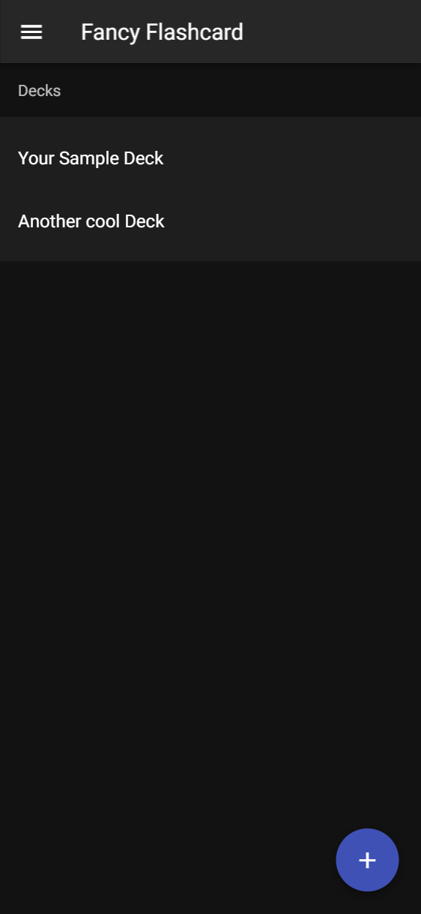
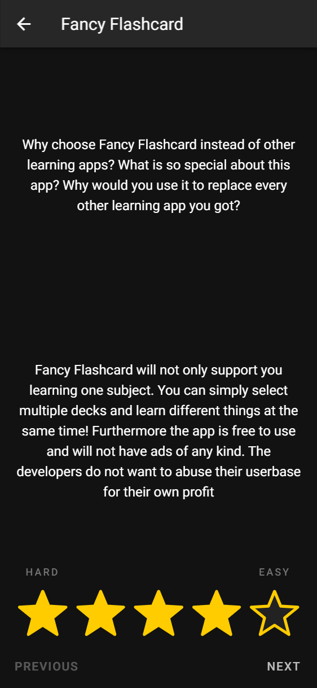
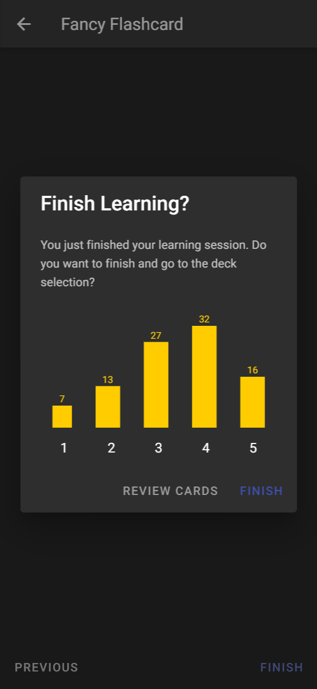
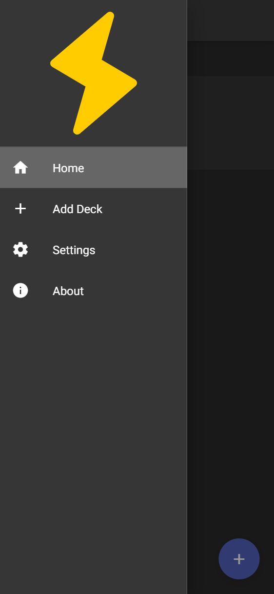
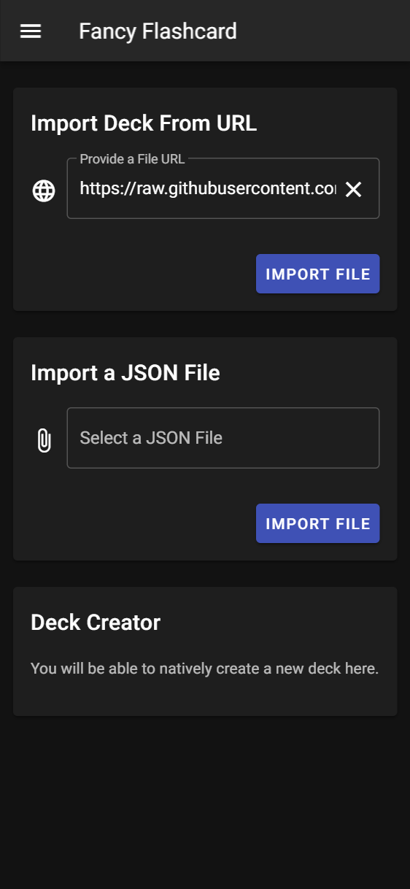

<!-- README inspired by https://github.com/othneildrew/Best-README-Template -->

<p align="center">
  <a href="https://github.com/fancy-flashcard/ffc">
    
  </a>

  <h3 align="center">Fancy Flashcard</h3>

  <p align="center">
    Lightweight open-source PWA to help you learning on all your devices
    <br />
    <a href="docs/"><strong>Explore the docs »</strong></a>
    <br />
    <br />
    <a href="https://fancy-flashcard.github.io/ffc/">Open PWA</a>
    ·
    <a href="https://github.com/fancy-flashcard/ffc/issues">Report Bug</a>
    ·
    <a href="https://github.com/fancy-flashcard/ffc/pulls">Contribute</a>
  </p>

  <p align="center">
    <a href="https://github.com/fancy-flashcard/ffc">
      
    </a>
  </p>
</p>

# Fancy Flashcard <!-- omit in toc -->

- [Screenshots](#screenshots)
- [Deployment](#deployment)
- [Contributing](#contributing)
  - [Project setup](#project-setup)
  - [Compiles and hot-reloads for development](#compiles-and-hot-reloads-for-development)
  - [Compiles and minifies for production](#compiles-and-minifies-for-production)
  - [Lints and fixes files](#lints-and-fixes-files)
- [License](#license)

## Screenshots








## Deployment
The app is build and deployed to https://fancy-flashcard.github.io/ffc on every push to master branch (via GitHub Actions and GitHub Pages).

## Contributing
Feel free to report bugs or ideas via [Issues](issues).
Also we highly appreciate [Pull Requests](pulls).
Check out the [docs](docs) to get started and see how to set up `Vue.js` below.

### Project setup
```
npm install
```

### Compiles and hot-reloads for development
```
npm run serve
```

### Compiles and minifies for production
```
npm run build
```

### Lints and fixes files
```
npm run lint
```

## License

Distributed under the MIT License. See [LICENSE](LICENSE) for more information.
